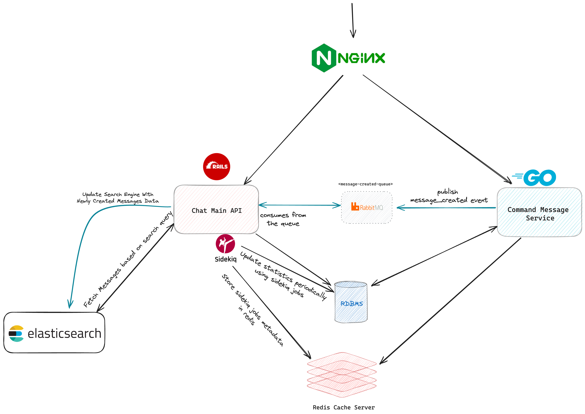

# Chat System

## Table of Contents

- [Business Requirements](#business-requirements)
- [System Design](#system-design)
- [How to Run](#how-to-run)
- [Remaining Enhancements](#remaining-enhancements)

## Business Requirements

This project aims to build a robust chat system with the following capabilities:

- **Application Management**: Users can create and retrieve their applications.
- **Chat Management**: Users can create and retrieve chats associated with their applications
- **Messaging**: Users can send messages to the chat associated with their application.
- **Search Functionality**: Messages can be searched and retrieved based on the message body for a specific chat.
- **Statistics Tracking**: Collect and update statistics periodically about chats and messages.


## System Design

The system is designed as a microservices architecture, with the following components:

1. **Nginx**: Acts as a reverse proxy to route requests to the appropriate services.
2. **Chat Main API (Ruby on Rails)**: Handles the main chat functionalities including message retrieval and updating the search engine.
3. **Command Message Service (Go)**: Responsible for handling message creation and publishing `message_created` events to RabbitMQ.
4. **RabbitMQ**: Acts as a message broker to facilitate communication between services.
5. **Sidekiq**: Processes background and queueing jobs for updating statistics and chat creation.
6. **Elasticsearch**: Used for indexing and searching messages.
7. **Redis**: For storing Sidekiq metadata and for caching chats and messages numbers.
8. **RDBMS (MySQL)**: Stores relational data related to chat messages and users.

### System Architecture Diagram



## How to Run

To run the system locally, follow these steps:

1. **Clone the repository**:

   ```bash
   git clone <repository-url>
   cd <repository-directory>
   ```

2. **Build and Run Docker Containers**:

   ```bash
   docker-compose up --build
   ```

3. **Access the Services**:
   - Postman API Documentation: `https://documenter.getpostman.com/view/31068233/2sA3kUH2Xt`
   - API: `http://localhost:8080`
   - RabbitMQ Management: `http://localhost:15672`
   - Elasticsearch: `http://localhost:9200`
   - MySQL: `localhost:3306`
    - Username: `root`
    - Password: `password`

## Remaining Enhancements

### API Security

- **Rate Limiting**: Implement rate limiting to prevent abuse and ensure fair usage.
- **Requests Sanitization**: Ensure all incoming requests are sanitized to prevent injection attacks.

### Code Quality

- **Adding Specs**: Add comprehensive unit and integration tests to the codebase to ensure reliability and maintainability.

### Resiliency

- **Circuit Breakers**: Implement circuit breakers to handle failures gracefully and prevent cascading failures in the system.
- **Retry Mechanism**: Add retry mechanisms for transient failures in asynchronous communication between microservices.

### Other Enhancements

- **Monitoring and Logging**: Enhance monitoring and logging to gain better insights into the system's behavior and performance.
- **Scalability**: Explore ways to scale the system horizontally to handle increased load.

# Current Issues:
- `chat_main_api` and `sidekiq_worker` containers are not running from the first time, the ruby application just need a retry logic with exponential backoff to connect to dependencies just as elasticsearch and rabbitmq, I might provide a fix later but for now I overcome this issue by just re-running these containers again from Docker Desktop after around 15-20s